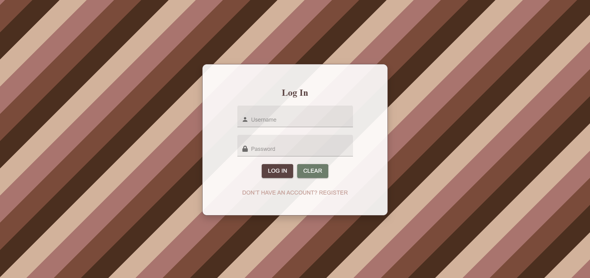
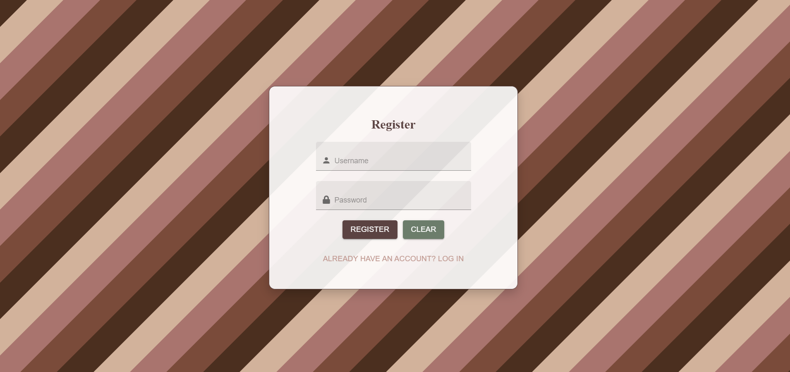
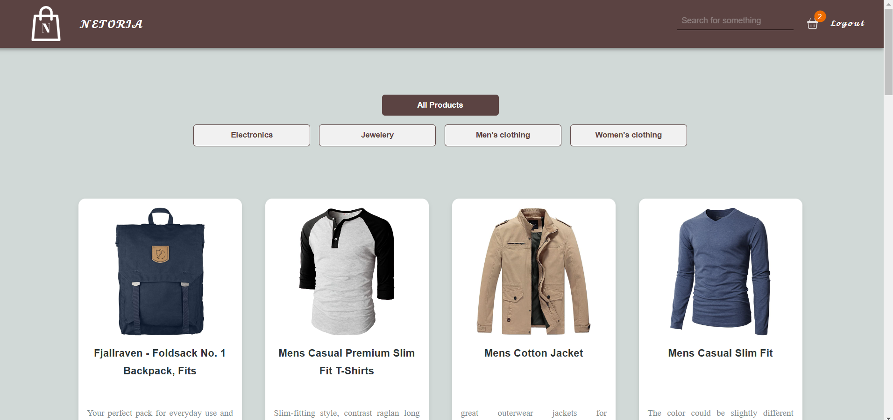
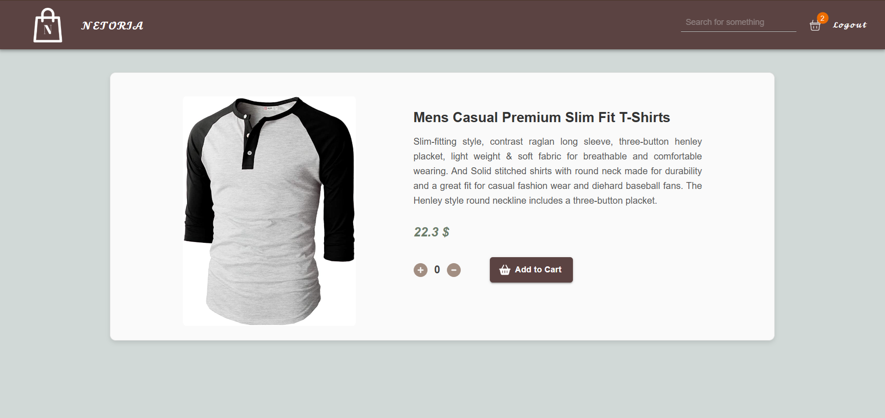
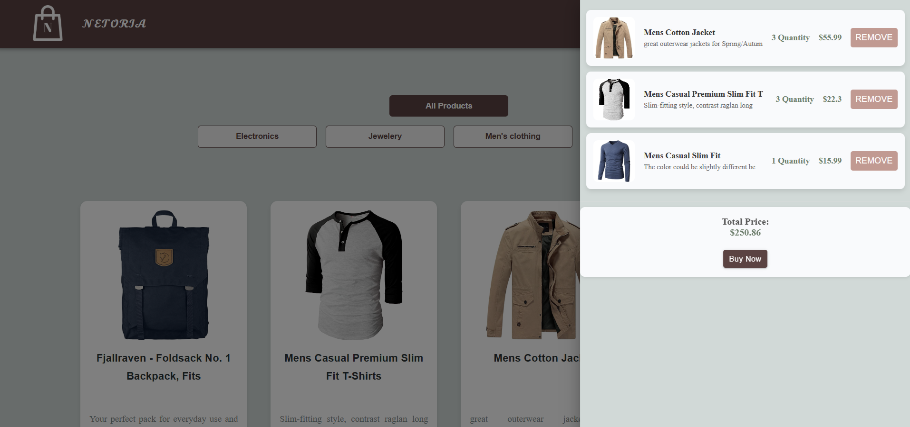

# Netoria E-Commerce Project

Welcome to the **Netoria E-Commerce** project, a modern  shopping platform built with **React**, **TypeScript**, and several other powerful tools and libraries. This project simulates a full-fledged e-commerce website, featuring product browsing, search functionality, categories filtering, cart management, user accounts, and much more.

## Features
- 🛍️ **Product Listing**: Displaying a wide range of products.
- 📄 **Product Details Page**: View detailed information about a specific product.
- 🔍 **Search and Filter**: Search products by name, and filter by categories.
- 🛒 **Cart Management**: Add, remove products from the cart and adjust quantities.
- 👤 **User Accounts**: Users can sign in, and each user starts with a balance of $1000 for purchasing products.
- 🔧 **Fake API**: Utilizes **JSON Server** to mimic a backend and handle data for products, users, and cart operations.

## Technologies Used
- ⚛️ **React** (with functional components and hooks)
- 🔠 **TypeScript** (for static type checking)
- 📦 **Redux Toolkit** (for global state management)
- 🎨 **Material-UI (MUI)** (for a consistent and modern UI)
- 🖼️ **React Icons** (for adding scalable vector icons)
- 🌐 **Axios** (for making HTTP requests)
- 📝 **Formik** & ✅ **Yup** (for form handling and validation)
- 🚗 **React Router DOM** (for routing and navigation)
- 🥳 **React Toastify** (for displaying toast notifications)
- 🗄️ **JSON Server** (for simulating a backend API)

## 📸 Preview








## Setup & Installation

To run the project locally, follow these steps:

### 1. Extract the file from the ZIP archive.

### 2.  Navigate to the project directory:
   ```bash
   cd E-COMMERCE
   ```

### 3.  Install dependencies:
   ```bash
   npm install
   ```

### 4. Running the JSON Server
```bash
json-server --watch ./src/jsonserver/db.json --port 4000
```

### 4.Start the development server
```bash
 npm run dev
```
